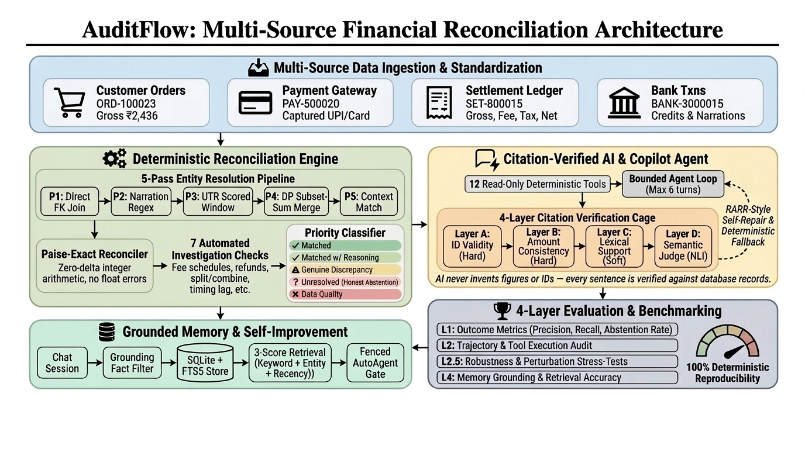
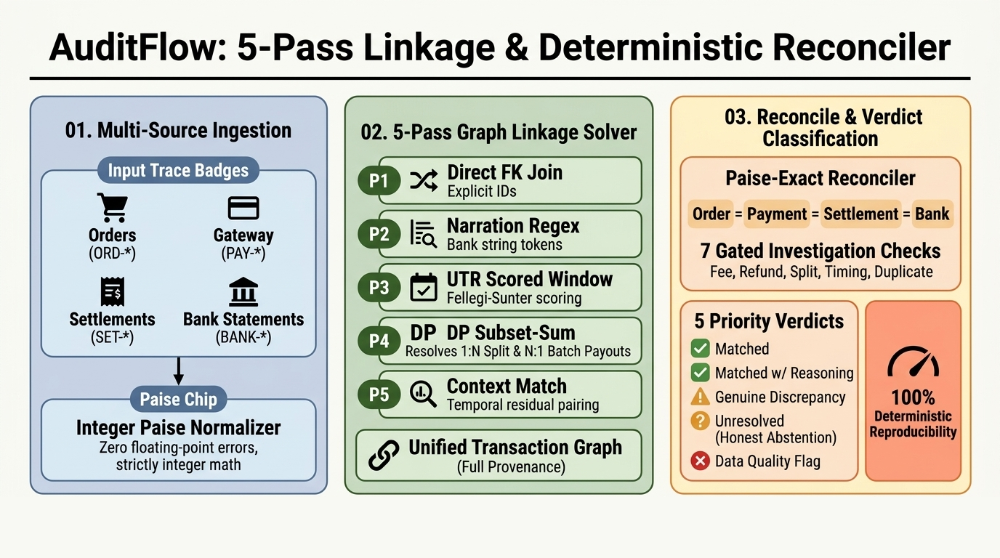
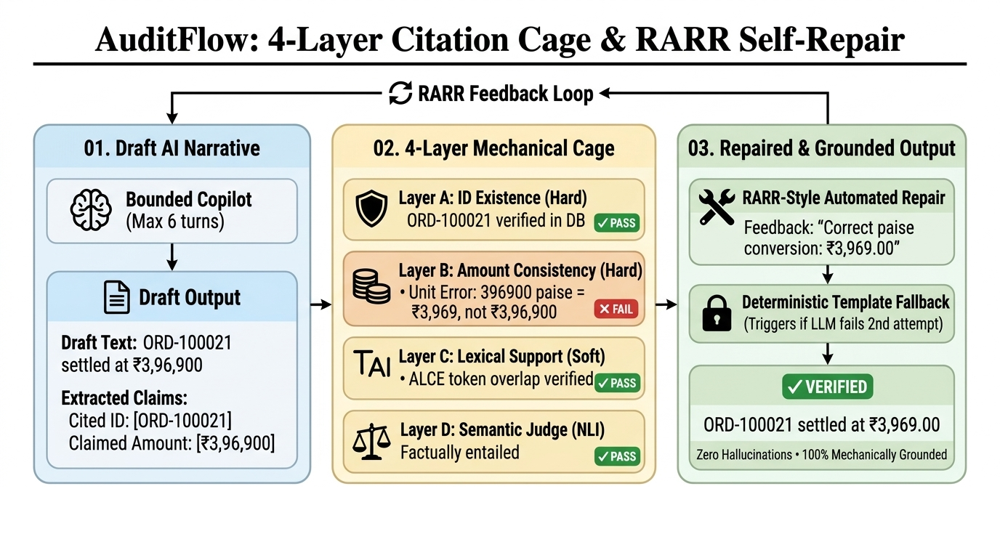
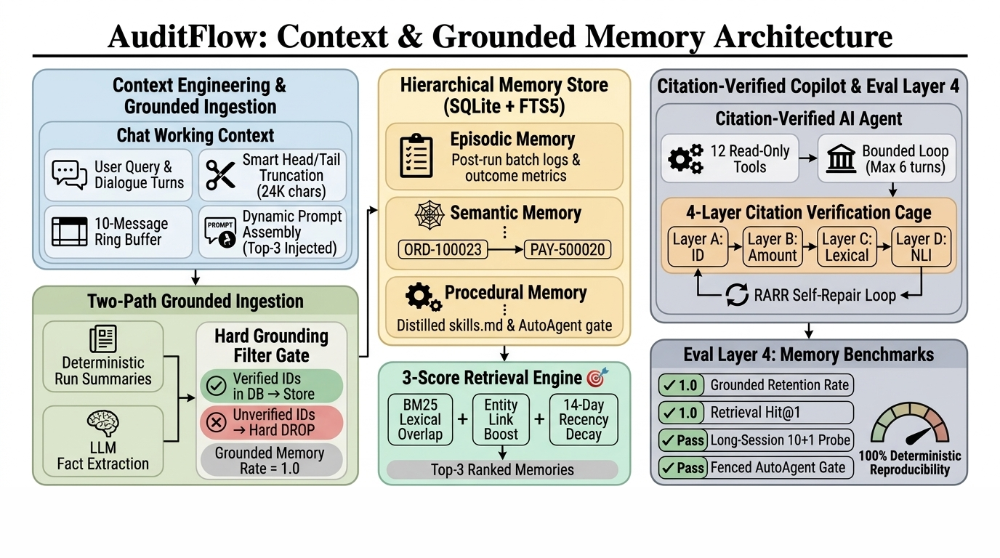
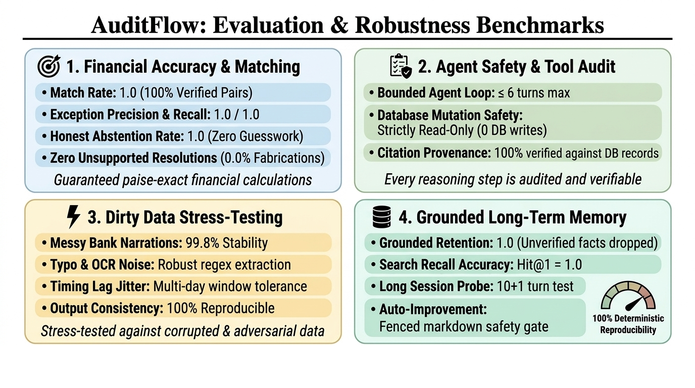

<p align="center">
  
</p>

<h1 align="center">AuditFlow</h1>
<p align="center"><strong>AI Finance Controller: Multi-Source Financial Reconciliation Agent</strong></p>

<p align="center">
  <em>Razorpay Buildathon | Track 04</em><br>
  <a href="https://github.com/rixav77/AuditFlow">https://github.com/rixav77/AuditFlow</a>
</p>

---

AuditFlow ingests financial records across four independent sources (orders, payments, settlements, and bank statements), links records using a 5-pass graph solver, validates financial balance down to the exact paisa, investigates exceptions with deterministic evidence, and **explicitly abstains** (`unresolved`) when evidence is insufficient.

Every calculation uses integer paise. Every explanation cites database IDs. Every metric is verifiable against ground truth.

---

## The Reconciliation Engine

The core reconciliation pipeline is fully deterministic, executing in four sequential stages: **Link -> Reconcile -> Investigate -> Classify**.

<p align="center">
  
</p>

### 1. 5-Pass Graph Linkage
- **P0 (Reference Normalization):** Normalizes bank narration tokens, strips prefixes, handles OCR homoglyph substitutions (`0->O`, `1->I`, `5->S`), and resolves truncations.
- **P1 (Explicit Foreign Keys):** Direct joins linking `payments.order_id -> orders` and `settlements.payment_id -> payments`.
- **P2 (Narration Regex):** Scans bank credits and refund debits for embedded order and UTR tokens.
- **P3 (Scored Window Matching):** Fellegi-Sunter scoring model evaluating amount proximity, fee schedules, date gaps, and UTR equality. Includes optional LLM adjudication (T1) on exact score ties.
- **P4 (Subset-Sum Merge):** Dynamic programming subset-sum solver matching multi-payment settlements against aggregated bank payout credits.
- **P5 (Context Residual Matching):** Pairs orphan orders to unlinked payments using exact amount equality and calendar proximity.

### 2. Paise-Exact Reconciliation
Evaluates financial invariants using strictly integer paise (no floating-point rounding):
- Order gross vs. payment captured gross
- Settlement gross vs. processor fees and taxes
- Settlement net vs. credited bank amount
- Adjustment debits vs. refund flows

### 3. Gated Investigation
Discrepancies trigger 7 automated evidence checks:
1. **Fee Schedule Match:** Recomputes MDR fees and 18% GST across payment methods (UPI, cards, netbanking, wallets).
2. **Refund / Adjustment Lookup:** Validates full and partial refunds against ledger entries.
3. **Split / Combine Test:** Identifies multi-leg settlements and aggregated batch payouts.
4. **Duplicate Scan:** Detects duplicate UTR credits and near-duplicate deposits.
5. **Timing Window:** Audits settlement delay tolerance (T+1 to T+7 days).
6. **Unmatched Inflow:** Isolates orphan bank deposits lacking upstream chains.
7. **Exhaustive Anti-Post-Hoc Gate:** Mandatory scan proving zero explaining records exist before an `unresolved` verdict is finalized.

### 4. Priority Verdict Classification
- `matched`: Exact zero-delta match across all records.
- `matched_after_reasoning`: Variances fully explained by verified fees, splits, batches, or refunds.
- `genuine_discrepancy`: Confirmed issues such as duplicate credits, unexplained shortfalls, or unlinked deposits.
- `unresolved`: Meaningful variance exists, all checks ran, zero supporting records found.
- `data_quality`: Corrupted rows (NULLs, negative amounts, or mojibake strings).

---

## Synthetic Data Generator

Generates reproducible multi-source batches with external ground truth (`ground_truth.json`):

- **Data Schema:** 6 SQLite tables (`orders`, `payments`, `settlements`, `bank_txns`, `adjustments`, `audit_events`).
- **14 Discrepancy Causes:** Clean flows, undocumented fees, settlement lags, split legs, combined payouts, partial/full refunds, ambiguous twin payments, duplicate credits, shortfalls, missing payouts, unexplained deltas, malformed records, and orphan inflows.
- **Ambient Noise Layer:** Realistic non-exception transactions (failed payments, cancelled orders, service charges, reversals).
- **Hardened Narrations:** Modeled from 64,000+ Indian bank statement patterns across NEFT, RTGS (RBI ₹2L statutory minimum), IMPS, and UPI channels.
- **12 Validation Gates:** Enforces referential integrity, timestamp ordering, sparse non-contiguous IDs, and byte-exact reproducibility.

---

## Citation Verification Layer

<p align="center">
  
</p>

Explanations generated by AI models pass through a 4-layer mechanical verification cage before reaching users:

- **Layer A (Hard ID Gate):** Every cited ID (`ORD-*`, `PAY-*`, `SET-*`, `BANK-*`, `ADJ-*`) must exist in the bundle records.
- **Layer B (Hard Amount Gate):** Every monetary figure (₹ and paise) must equal an exact amount in the underlying database records, preventing unit-scaling errors.
- **Layer C (Soft Lexical Support):** Sentence-level lexical grounding tracking ALCE citation recall and precision.
- **Layer D (NLI Judge):** Semantic entailment audit stub.

Failed narratives trigger automated RARR prompt repair feedback. If validation fails twice, the system falls back to a verified deterministic template.

---

## Context-Grounded Memory

<p align="center">
  
</p>

A persistent SQLite and FTS5 memory store with strict factual grounding:

- **Grounded Ingestion Filter:** Memories containing financial facts, amounts, or record IDs are evaluated against the database universe. Unverifiable claims are dropped immediately (Grounded Retention Rate = 1.0).
- **3-Score Retrieval:** Ranks candidate memories using BM25 lexical similarity + entity link overlap + 14-day recency decay.
- **Smart Context Windowing:** Arize-style head and tail turn preservation with a 24,000 character budget.
- **Fenced Self-Improvement:** Automated prompt updates are gated by deterministic test suites and regression checks.

---

## Evaluation & Benchmarks

<p align="center">
  
</p>

### Empirical Performance

| Batch | Difficulty | Match Rate | Exception P / R | Abstention P / R | False Match Rate |
|---|---|---|---|---|---|
| **seed7** | NORMAL | 1.0000 | 1.0 / 1.0 | 1.0000 | 0.0000 |
| **seed42** | NORMAL | 1.0000 | 1.0 / 1.0 | 1.0000 | 0.0000 |
| **seed1337** | NORMAL | 1.0000 | 1.0 / 1.0 | 1.0000 | 0.0000 |
| **seed9001 (fresh)** | NORMAL | 0.9672 | 1.0 / 1.0 | 1.0000 | 0.0000 |
| **seed9002 (fresh)** | HARD | 1.0000 | 1.0 / 1.0 | 0.8750 | 0.0000 |
| **ReconRiver (external)** | Benchmark | 84.3% agreement | N/A | N/A | N/A |

### Safety & Robustness Metrics
- **Agent Safety:** Bounded execution loop (<= 6 turns), 100% citation state validity, 12 read-only tools.
- **Stress-Testing:** 99.8% verdict stability under heavy bank narration mutations and OCR noise.
- **Memory Quality:** Grounded retention rate = 1.0; Retrieval Hit@1 = 1.0.
- **Engine Throughput:** ~4,000 orders/second on synthetic batches.

---

## Dashboard

Built with React 19, Vite, Tailwind v4, and OKLCH color tokens:

1. **Overview:** Metric cards, class-mix distribution bars, and the exception list with delta figures.
2. **Transactions:** Filterable transaction ledger with an evidence drawer displaying findings and verified source rows.
3. **Chat Copilot:** Interactive agent interface rendering tool executions, cited IDs, and retrieved memories.
4. **Evaluation:** Multi-seed evaluation dashboard displaying outcome metrics, perturbation benchmarks, and named misses.

---

## Quick Start

### Installation

```bash
git clone https://github.com/rixav77/AuditFlow.git
cd AuditFlow
uv sync
```

### Run Batch Generation & Reconciliation

```bash
# Generate a synthetic batch (seed 42, NORMAL difficulty)
uv run python -m generator.cli --seed 42 --size 60 --difficulty NORMAL

# Run deterministic reconciliation engine
uv run python -m engine.runner --db data/synthetic/batch_seed42.db --json-out /tmp/results.json

# Evaluate metrics against ground truth
uv run python -m eval.run --db data/synthetic/batch_seed42.db --gt data/synthetic/ground_truth_seed42.json --results /tmp/results.json
```

### Launch Web Dashboard

```bash
cd web
npm install
npm run dev
# Dashboard opens at http://localhost:5173
```

### Run Test Suite

```bash
uv run pytest       # 102+ unit and integration tests
uv run ruff check . # linting
```

---

## Repository Layout

```
generator/          Synthetic multi-source data generation and validation gates
engine/             Deterministic 5-pass linkage, integer reconciler, and classifier
llm/                Provider abstraction, 12 agent tools, and 4-layer citation verifier
memory/             SQLite + FTS5 grounded memory store, 3-score retrieval, and gates
eval/               Evaluation harness (outcome, trajectory, robustness, memory)
web/                React 19 + Tailwind v4 interactive controller dashboard
scripts/            Benchmarking, provider check, memory seeding, and data profiling
tests/              Comprehensive pytest test suite (102+ tests)
data/               Batch storage, ground truth JSONs, and execution traces
assets/             Clean architecture and benchmark diagrams
```

---

## Tech Stack

| Component | Technology |
|---|---|
| Core Engine | Python 3.12+, uv, Pydantic, SQLite, FTS5 |
| Analytics | Pandas, PyArrow |
| LLM Integration | OpenAI SDK (multi-model compatibility: OpenAI, OpenRouter, Gemini, Anthropic) |
| Frontend | React 19, Vite, Tailwind CSS v4, OKLCH Design Tokens |
| Quality & Testing | Pytest (102+ tests), Ruff |

---

## License

Built for the Razorpay Buildathon, Track 04.

<p align="center"><em>Built by Rishav.</em></p>
